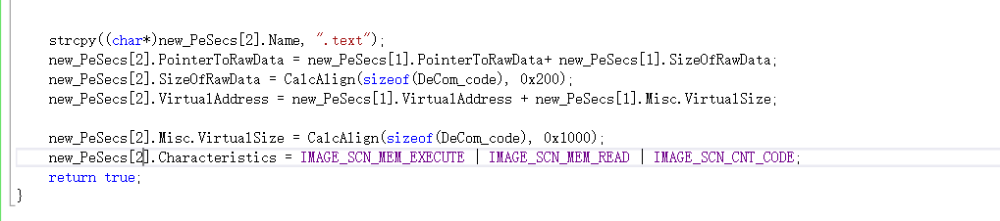
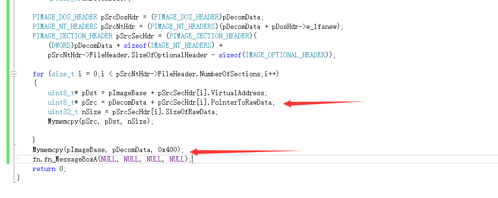

[TOC]

# 思路

压缩壳我看了看其他人的实现思路大致是下面这张图

将源程序压缩后放在一个节中，然后预留出来一个空节用于解压，当程序运行后

把原本的空节和pe头覆盖为原程序的节，然后跳到oep执行即可，接下来按照这个思路实现一个压缩壳

# 实现过程

## 打开文件

通过文件映射的方式拿到指定路径中文件的数据和大小

## 压缩文件

这里压缩用了微软自带的api函数

压缩的效果还是可以的，从32768压缩成9727

## 构造节

我们一共需要三个节

1. 空节
2. 数据节
3. 代码节

构造第一个节，因为是空节所有没有文件大小，映射到内存中的地址是0x1000，内存大小这里直接使用了源程序的SizeOfImage作为空节在内存中的大小

第二个节是压缩的数据，因为第一个节是空节，所有他的文件偏移直接就挨着pe头在0x400的位置，文件大小计算压缩后的数据大小，这里要与0x200对齐，内存中的地址，就是上一个节的地址加上上一个节的大小，内存大小与0x1000对齐

这里解压的代码先使用nop占着

这里和上面一样根据上一共节，计算这个节的偏移，计算相应的对齐值

计算对齐值的函数也比较简单

## 构造PE头

因为最后的pe头也要还原回去原本的pe头，所有我们直接对源程序的pe进行修改

把节之前的数据copy过去

在新的pe头中我们需要关注的是，节的数量，入口点，内存对齐值，文件对齐值，内存中的大小，并将数据目录清空，接下来再把节复制进去

在把节复制到新的pe里面

调试一下能看到已经成功构造pe头了

## 生成pe

写入到pack.exe文件中，显示pe头，空节因为是空的所以不用写，然后就是压缩的数据，大小就是节的SizeOfRawData，同样还有代码节

## 调试

这里说格式有问题，用CFF看看

这里的数据目录居然没有清零，后面发现问题了，我的项目是x86的，但是我处理的我文件是x64的

这样就没有报错文件格式问题，我们调试一下

可以看到从nop开始执行，这个就是我们最开始写的0x90

## 解压代码

这需要编写shellcode，这里就不再重复水字数了

通过ped获取到当前进程的模块基址，寻找到解压的数据，这里发现一个问题，需要获取到解压后的大小，压缩后的数据大小

我们添加一个结构体，保存解压前后的大小

在原本的压缩数据之前添加上一个新的结构体

在shellcode编写中，通过节表先找到数据的地址，开头就是DataInfo，然后往后偏移sizeof(DataInfo)个字节，就是压缩的数据

根据解压后的大小和压缩数据的大小，申请内存并解压数据，然后就下了就是处理pe

## 恢复pe结构

接下来开始恢复pe原本的结构，突然再调试的过程中发现问题了

cavinet.dll做为参数调用loadlibraryA

然后再调用getprocaddress

返回值却是0

后面另一个解压的函数，返回的结果也是0000

后面我发现问题在哪了，我调试的机器是win7,这几个api最低要求win8

放在win10上调试发现，怎么也没有返回结果？好像没找到CreateDecompressor这个函数，再整个调用过程中都没出现这个字符串，反复确认CreateDecompressor没有寻找到

我字符串呢?在栈里面没有找到

为什么这个字符串在这里，明明分配的是在栈上啊

后面把优化禁用掉了，发现就没问题了，应该是优化的时候栈空间不够？然后就优化到其他节里面了？

解压后就是处理节，把解压后的节覆盖掉当前进程中对应的位置，这里再弹个窗，便于dump看看内存对不对

发现这个memcpy函数有点问题，还是我自己实现吧

我自己实现的发现好像有点问题，在复制第一个M的时候停下了，EXECEPTION_ACCESS_VIOLATION

不对啊，这里应该是处理节，怎么会在拷贝头？发现我写反了，应该是压缩数据拷贝到模块机制

先把当前进程的基址传进去

再把节传了进去，看了内存明显不对

貌似解压不太成功，这里生气的内存是01c0000,解压后发现全是0

这里传入的参数也有问题，解压时候正确的传入压缩数据的位置

这里出问题了，用的应该是文件偏移不是内存中的地址

改成这样，发现也不对，后面捋一捋逻辑（chatgpt）

应该是压缩数据开始往后偏移

现在就解压成功了

这样就能正确的处理节了，这里就是处理完的节，这样就把空节还原成原本的pe结构了

### 处理导入表

这里处理导入表也不重复了

### OEP

这里就简单的跳到oep就行了，这里还却一个重定位表的处理

我这里压缩的是cs的阶段木马，这个压缩的效果不明显

成功运行

压缩无阶段的效果会明显一些，这里没有处理重定位表，不过也能正常运行，最后补上了重定位表

# 免杀效果

传沙箱看看会出现什么，目测应该直接就杀了

因为没有处理原本文件的特征，在内存中展开的时候直接就被匹配杀了，突然有了点思路实现一个加密壳，看了看之前的一篇文件，自己申请的内存，然后模拟asm指令的操作，shellcode所有的变量都是在栈上，自己申请一段内存作为栈，最后在修改ebp esp到自己的栈对应的位置，这样就弄出了一个解释器。